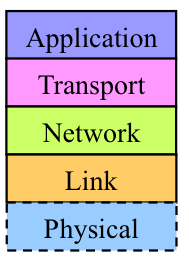

# Assignment 0

## What is a protocol stack, and how is it used in web development?
In web development, a protocol stack refers to the set of communication protocols used between different layers of a web application. It is a combination of protocols that work together to enable communication between different components of a web application. The most commonly used protocol stack in web development is the TCP/IP protocol stack, which includes the HTTP protocol for web communication. The protocol stack is used to ensure that data is transmitted reliably and efficiently between different components of a web application.

## What are the different types of web servers, and how do they differ in terms of functionality and performance?
GitHub Copilot: There are several types of web servers, including Apache, Nginx, IIS, and GWS. These web servers differ in terms of functionality and performance. 

Apache is the most widely used web server and is known for its flexibility and ability to handle a large number of requests. It is open-source and can be used on a variety of operating systems. 

Nginx is a lightweight web server that is known for its high performance and ability to handle a large number of concurrent connections. It is often used as a reverse proxy server and is commonly used for serving static content.

IIS (Internet Information Services) is a web server developed by Microsoft and is commonly used on Windows servers. It is known for its ease of use and integration with other Microsoft technologies.

GWS (Google Web Server) is a web server developed by Google and is used to serve Google's own websites. It is highly optimized for performance and is known for its ability to handle a large number of requests. 

Overall, the choice of web server depends on the specific needs of the application and the environment in which it will be deployed.

## What is web hosting, and what are the different types of hosting services available for websites?

Web hosting is a service that allows individuals and organizations to make their websites accessible via the World Wide Web. A web host provides the infrastructure and technologies needed for a website to be viewed on the internet.

There are several types of web hosting services available, including:

Shared hosting: This is the most common type of web hosting, where multiple websites are hosted on a single server. It is an affordable option for small websites with low traffic.

Virtual Private Server (VPS) hosting: This type of hosting involves a single physical server being divided into multiple virtual servers. Each virtual server has its own resources and operating system, providing more control and flexibility than shared hosting.

Dedicated hosting: With dedicated hosting, a single server is dedicated to a single website. This provides the highest level of control and performance, but is also the most expensive option.

Cloud hosting: This type of hosting involves multiple servers working together to host a website. It provides scalability and flexibility, and is often used by websites with high traffic or unpredictable traffic patterns.

Managed hosting: With managed hosting, the web host takes care of the technical aspects of website management, such as updates and backups. This allows website owners to focus on content creation and other aspects of their business.

The choice of web hosting service depends on the specific needs of the website, including traffic volume, security requirements, and budget.

## What is scaling, and why is it important for web applications? How does scaling differ for vertical and horizontal scaling?
Scaling refers to the process of increasing the capacity of a web application to handle more traffic and users. It is important for web applications because as the number of users and traffic increases, the application may become slow or unresponsive, leading to a poor user experience. Scaling ensures that the application can handle the increased load and maintain its performance.

There are two types of scaling: vertical scaling and horizontal scaling.

Vertical scaling involves increasing the resources of a single server, such as adding more RAM or CPU. This approach is limited by the maximum capacity of the server and can be expensive.

Horizontal scaling involves adding more servers to a system, distributing the load across multiple machines. This approach is more flexible and can handle larger amounts of traffic, but requires additional infrastructure and management.

The choice of scaling approach depends on the specific needs of the application, including the expected traffic volume, budget, and infrastructure.

## What is SEO (Search Engine Optimization), and how can web developers optimize their websites for better search engine rankings?

SEO (Search Engine Optimization) is the practice of optimizing a website to improve its visibility and ranking in search engine results pages (SERPs). The goal of SEO is to increase the quantity and quality of organic traffic to a website.

Web developers can optimize their websites for better search engine rankings by following these best practices:

Conduct keyword research: Identify the keywords and phrases that users are searching for related to the website's content and incorporate them into the website's content and metadata.

Optimize website structure: Ensure that the website's structure is easy to navigate and understand for both users and search engines. Use descriptive URLs, header tags, and internal linking to help search engines understand the website's content.

Improve website speed: Optimize website speed by minimizing file sizes, compressing images, and using caching techniques to reduce load times.

Create high-quality content: Develop high-quality, original content that is relevant to the website's audience and incorporates targeted keywords.

Build high-quality backlinks: Acquire high-quality backlinks from reputable websites to improve the website's authority and credibility.

Use social media: Promote the website's content on social media platforms to increase visibility and drive traffic to the website.

By following these best practices, web developers can improve their website's search engine rankings and drive more organic traffic to their website.
